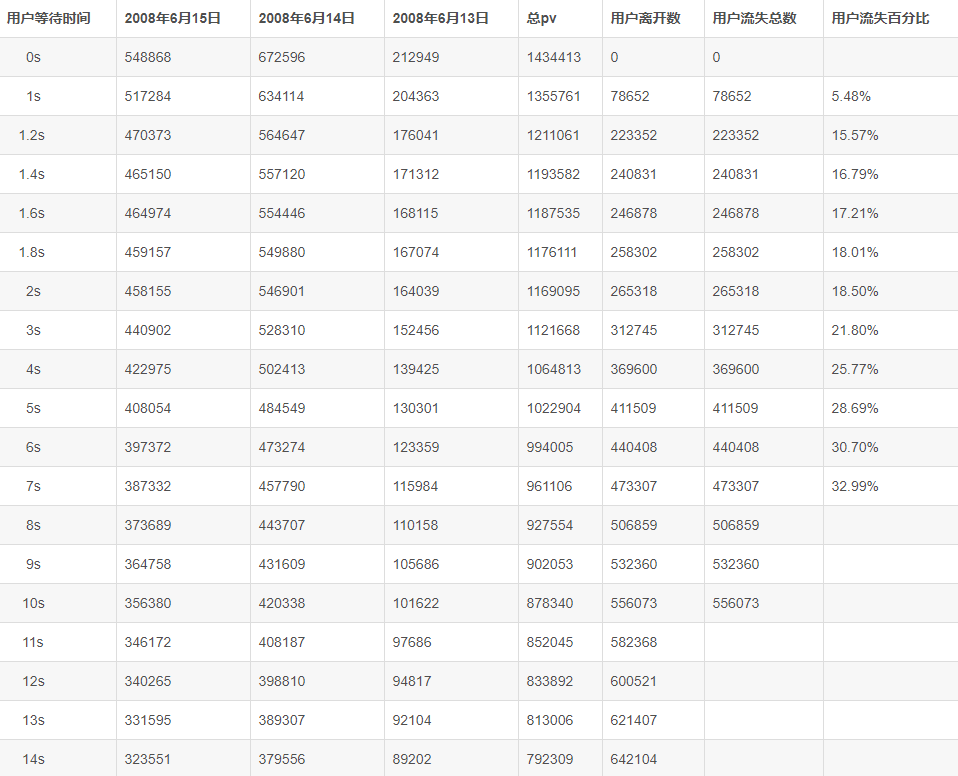

## 为什么要优化？

**客户等待页面时长的流失率**



作为一个开发者，你对首页打开速度又有多高的要求呢？

## 现在开始


### 1.代码压缩

首先需要下载一些依赖

**css 代码压缩 (optimize-css-assets-webpack-plugin)**

下载

```shell
npm install optimize-css-assets-webpack-plugin
```

webpack.config.js 使用

```js
const OptimizeCSSPlugin = require('optimize-css-assets-webpack-plugin');
plugins: [
    new OptimizeCSSPlugin()
]
```

**js 代码压缩 (uglifyjs-webpack-plugin)**

下载

```shell
npm install optimize-css-assets-webpack-plugin
```

webpack.config.js 使用

```js
const UglifyJsPlugin = require('uglifyjs-webpack-plugin')
plugins:[
      new UglifyJsPlugin({
      cache: true,   // 开启缓存
      parallel: true, // 开启多线程编译
      sourceMap: true,  // 是否sourceMap
      uglifyOptions: {  // 丑化参数
        comments: false,
        warnings: false,
        compress: {
          unused: true,
          dead_code: true,
          collapse_vars: true,
          reduce_vars: true
        },
        output: {
          comments: false
        }
      }
    }),
]
```

**开启gzip**

安装

```shell
npm install compression-webpack-plugin
```

webpack.config.js 使用

```js
const CompressionWebpackPlugin = require('compression-webpack-plugin')
plugins:[
    new CompressionWebpackPlugin({
      asset: '[path].gz[query]',
      algorithm: 'gzip',
      test: new RegExp(
        '\\.(' +
        ['js', 'css'].join('|') +
        ')$'
      ),
      threshold: 10240,
      minRatio: 0.8
	})
]
```

nginx 配置

```nginx
gzip on;
gzip_static on;
gzip_min_length 1k;
gzip_buffers 4 32k;
gzip_http_version 1.1;
gzip_comp_level 2;
gzip_types text/plain application/x-javascript text/css application/xml;
gzip_vary on;
gzip_disable "MSIE [1-6].";
```

### 2. 使用cdn开始性能优化

1. index.html中引入js

2. webpack externals中进行配置

```js
externals:{
    'vue':'Vue',
    'mint-ui':'MINT',
    'axios':'axios',
    'vue-router':'VueRouter',
    'vue-i18n':'VueI18n',
},
```

### 3.修改路由引入方式

路由懒加载